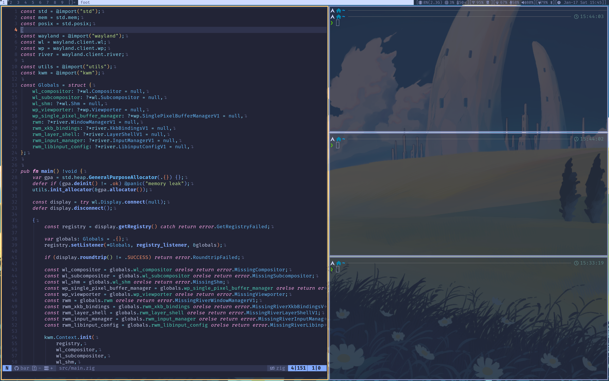
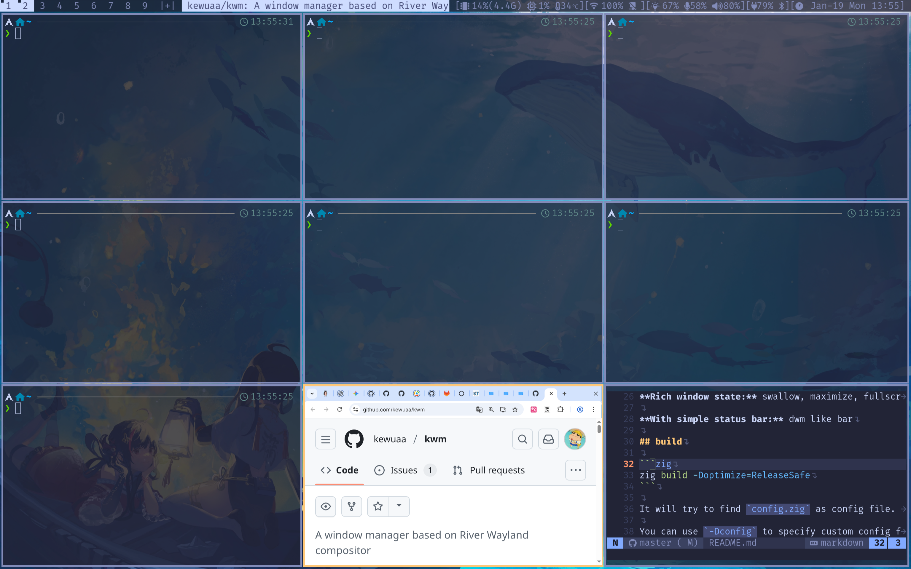
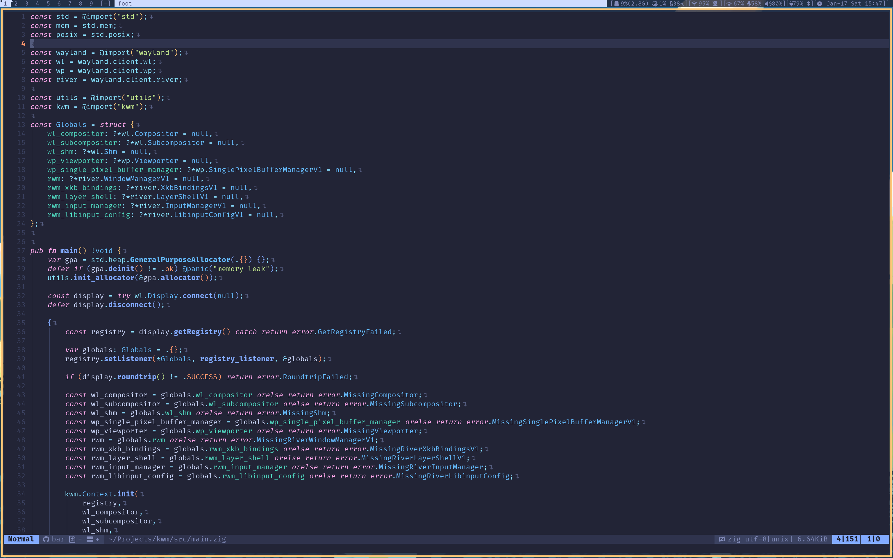
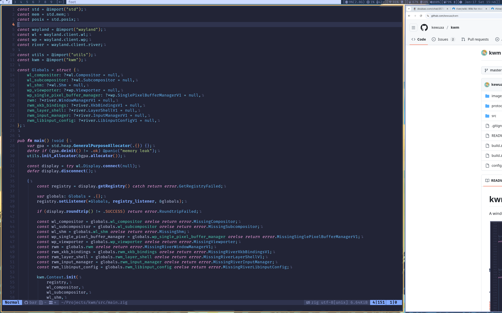

# kwm - kewuaa's Window Manager

A window manager based on River Wayland Compositor, written in Zig









## Requirements

- Zig 0.15
- River Wayland compositor 0.4.x (with river-window-management-v1 protocol)

## Features

**Multiple layout:** tile, grid, monocle, scroller, floating

**Tag:** base tags not workspaces (supports separate window layouts for each tag)

**Rule support:** regex rule match

**Bindings:** bindings in different mode such as default, passthrough orelse your custom mode

**Rich window state:** swallow, maximize, fullscreen, fakefullscreen

**With simple status bar:** dwm like bar

## build

```zig
zig build -Doptimize=ReleaseSafe
```

- `-Dconfig`: specify custom default config file path, `config.zon`(if not exists, will copy from `config.def.zon`) will used by default.
- `-Dbar`: to enable/disable status bar, default is true.

## configuration

### compile time

If you want to configure at compile time, make your custom modifications in `config.zon`(if not specify custom config path by `-Dconfig`).

### runtime

`kwm` will search user config file follow:
- `$XDG_CONFIG_HOME/kwm/config.zon`
- `$HOME/.config/kwm/config.zon`

The user configuration will override the compile time configuration.
You can declare only the configuration items that need to override compile time in the user configuration file, instead of declaring all configuration items.

## usage

Run `kwm` in your river init file or run with `river -c kwm`.

It should be noted that the `quit` action only quit the kwm but not quit river session. It allow you restart kwm directly. If you want to quit river session, try to use `Ctrl+Alt+Delete`.

You could remap keyboard keys(e.g. swap CapsLock with Escape) by setting the XKB layout rules before starting river:
```sh
export XKB_DEFAULT_OPTIONS=caps:swapescape,altwin:swap_alt_win
```
For all options available see `man 7 xkeyboard-config`

## Thanks to these reference project

- https://github.com/riverwm/river - River Wayland compositor
- https://github.com/pinpox/river-pwm - River based window manager
- https://codeberg.org/machi/machi - River based window manager
- https://codeberg.org/dwl/dwl - dwm for wayland
- https://codeberg.org/dwl/dwl-patches/src/branch/main/patches/swallow/swallow.patch - swallow window patch for dwl
- https://github.com/mnemnion/mvzr - regex support

## License

The source code in this project is released under the [GPL-3.0](./LICENSE)
