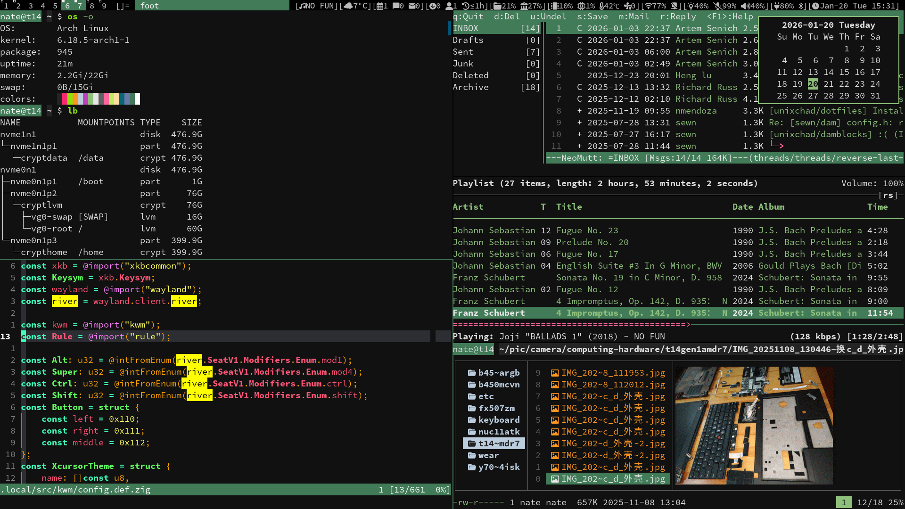
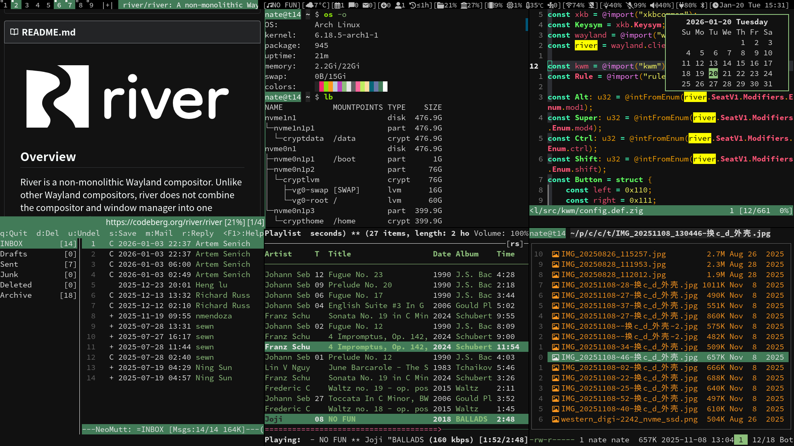
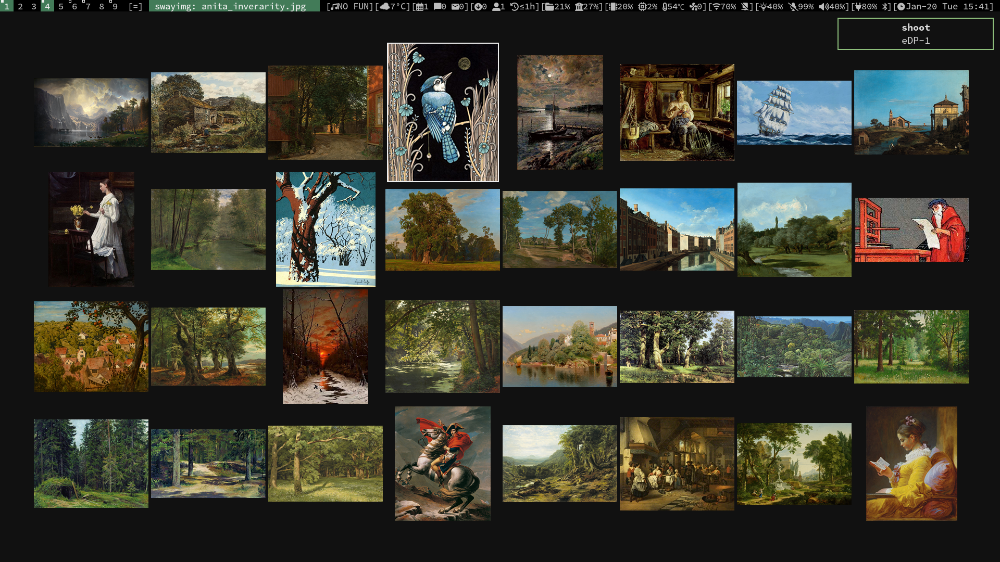
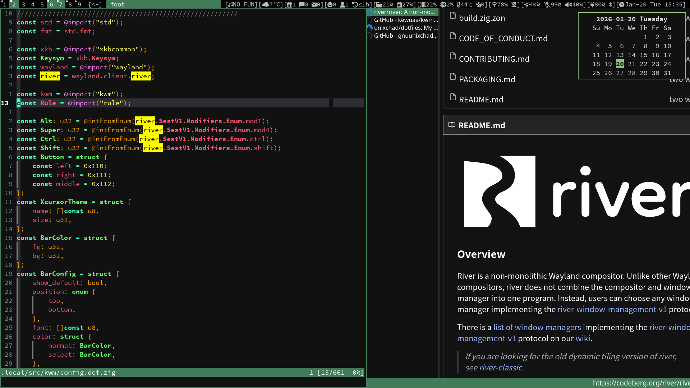

#  My build of [kwm](https://github.com/kewuaa/kwm) - kewuaa's Window Manager

A window manager based on River Wayland Compositor, written in Zig









## usage
For changes I've made, check [patches](./patches)

Add below in  `~/.config/river/init`
```sh
# Start kwm with damblocks, a line generator with signaling support I wrote
# https://codeberg.org/unixchad/damblocks
# https://github.com/gnuunixchad/damblocks
${HOME}/.local/bin/damblocks | /usr/local/bin/kwm
```

And run
```sh
exec ssh-agent river --no-xwayland
```

## Requirements

- Zig 0.15
- River Wayland compositor 0.4.x (with river-window-management-v1 protocol)

## Features

**Multiple layout:** tile, grid, monocle, scroller, floating

**Tag:** base tags not workspaces (supports separate window layouts for each tag)

**Rule support:** regex rule match

**Bindings:** bindings in different mode such as default, passthrough orelse your custom mode

**Rich window state:** swallow, maximize, fullscreen, fakefullscreen

**With simple status bar:** dwm like bar

## build

```zig
zig build -Doptimize=ReleaseSafe
```

It will try to find `config.zig` as config file. If not found, will create it from `config.def.zig` as backup.

You can use `-Dconfig` to specify custom config file path, `-Dbar` to enable/disable status bar, default is true, `-Doptimize` to specify build mode.

## configuration

Make your custom modifications in `config.zig`.

## Thanks to these reference project

- https://github.com/riverwm/river - River Wayland compositor
- https://github.com/pinpox/river-pwm - River based window manager
- https://codeberg.org/machi/machi - River based window manager
- https://codeberg.org/dwl/dwl - dwm for wayland
- https://codeberg.org/dwl/dwl-patches/src/branch/main/patches/swallow/swallow.patch - swallow window patch for dwl

## License

The source code in this project is released under the GPL-3.0 license.
