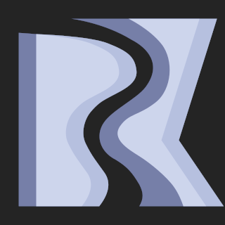
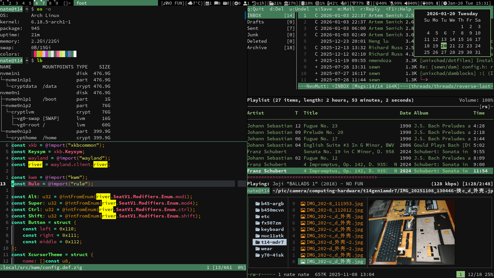
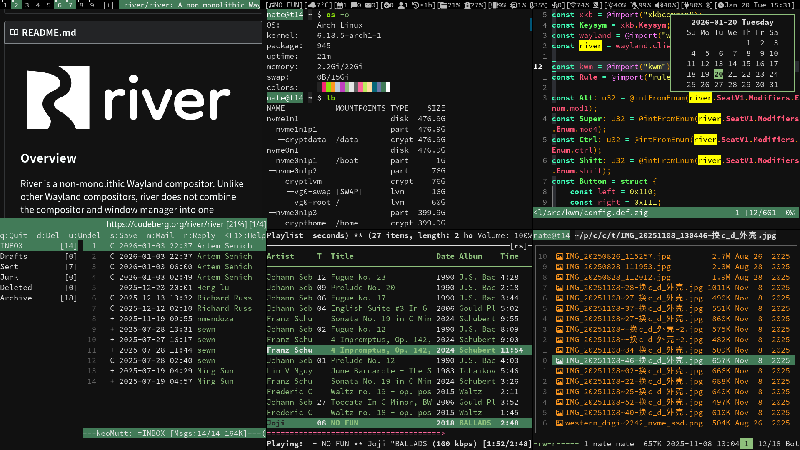
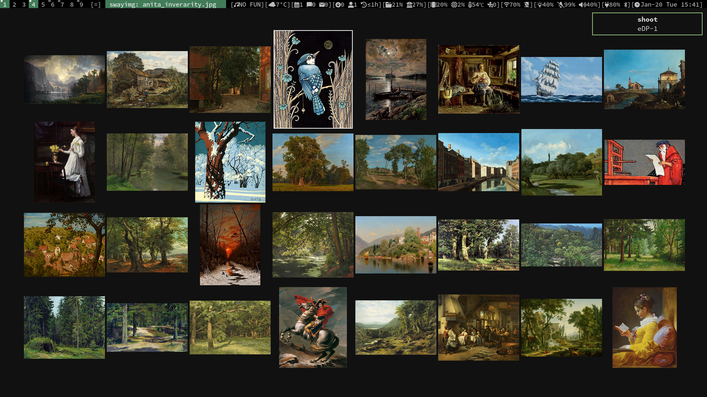
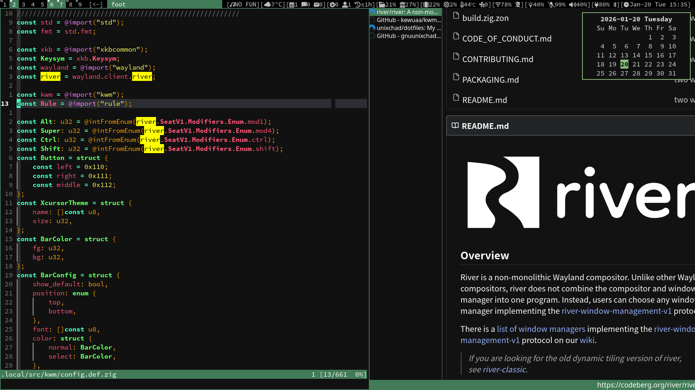

#  My build of [kwm](https://github.com/kewuaa/kwm) - kewuaa's Window Manager

A window manager based on River Wayland Compositor, written in Zig









For changes I've made, check [patches](./patches)

## Requirements

- Zig 0.15
- [river] >= 0.4.x (with river-window-management-v1 protocol)

## Features

- **Layouts:** tile, grid, monocle, deck, scroller, and floating, with per-tag
customization

- **Tags:** organize windows with tags instead of workspaces, with shift-tags
support

- **Rules:** regex pattern matching for window rules

- **Modes:** separate keybindings for each mode (default, lock, passthrough,
custom)

- **Window States:** swallow, maximize, fullscreen, fake fullscreen, floating,
sticky

- **Autostart:** run commands on startup

- **Status Bar:** dwm-like bar, supporting static text, stdin, and fifo, with
  customized colors

- **Configuration:** support both compile-time and runtime configuration,
  reloading on the fly

See the default [configuration](./config.def.zon) file for detailed features.

## Build

```zig
zig build -Doptimize=ReleaseSafe
```

- `-Dconfig`: specify the default config file path (defaults to `config.zon`,
  copied from `config.def.zon` if missing)
- `-Dbar`: enable or disable the status bar (defaults to `true`)
- `--prefix`: specify the path to install files

## Configuration

### Compile Time

Make custom modifications in `config.zon` (if `-Dconfig` is not specified).

### Runtime

`kwm` searches for a user configuration in the following paths:
- `$XDG_CONFIG_HOME/kwm/config.zon`
- `$HOME/.config/kwm/config.zon`

The user configuration overrides compile-time configuration. You only need to
specify the values you want to change, rather than duplicating the entire
configuration.

User configuration can be reloaded on the fly with
<kbd>mod4</kbd>+<kbd>shift</kbd>+<kbd>r</kbd>.

## Usage

Run `kwm` in your river init file, or start it with `river -c kwm`.

### Keymaps

Keyboard mapping can be customized by setting XKB layout rules before launching
river. For example, to swap <kbd>CapsLock</kbd> with <kbd>Escape</kbd>:

```sh
export XKB_DEFAULT_OPTIONS=caps:swapescape,altwin:swap_alt_win
```

### How I run kwm with river
Read status from a fifo(to restart the status command without restarting kwm)
```zig
// config.zon
.status = .{ .fifo = "/run/user/1000/damblocks.fifo" },
```
Add below in  `~/.config/river/init`
```sh
/usr/local/bin/kwm &
# Start kwm with damblocks, a line generator with signaling support I wrote
# https://codeberg.org/unixchad/damblocks
${HOME}/.local/bin/damblocks --fifo &
```

And run
```sh
exec ssh-agent river
```

To restart the bar script
```sh
nohup damblocks --fifo >/dev/null 2>&1 &
```

## Acknowledgments
Thanks to the following reference projects:

- [river] - Wayland compositor
- [river-pwm] - River-based window manager
- [machi] - River-based window manager
- [dwl] - dwm for Wayland
- [swallow patch] - swallow window patch for dwl
- [mvzr] - regex support

## License

The source code of kwm is released under the [GPL-3.0].

The protocols in `protocol/` directory prefixed with river and developed by the
[River] project are released under the ISC license (as stated in their
copyright blocks).

## Contributing

Contributions are welcome! By contributing to kwm, you agree that your
submitted code will be licensed under [GPL-3.0]. It is the contributors'
responsibility to ensure that all submitted code is either original or
GPL-3.0-compatible.

[GPL-3.0]: ./LICENSE
[river]: https://codeberg.org/river/river
[river-pwm]: https://github.com/pinpox/river-pwm
[machi]: https://codeberg.org/machi/machi
[dwl]: https://codeberg.org/dwl/dwl
[swallow patch]: https://codeberg.org/dwl/dwl-patches/src/branch/main/patches/swallow/swallow.patch
[mvzr]: https://github.com/mnemnion/mvzr
